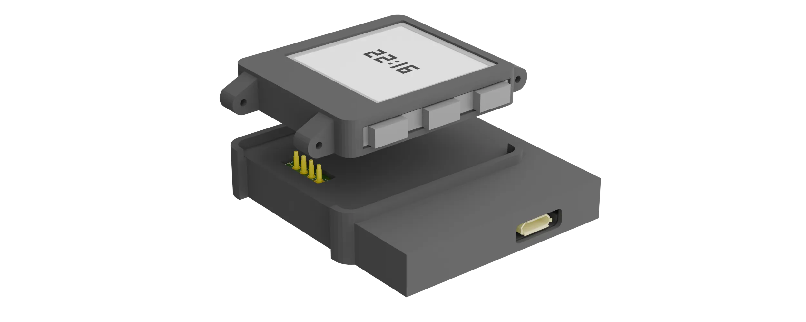

# epd watch

 

A low power epaper smartwatch running on an NRF52832.  
It has the basic functionalities like telling time, a stopwatch, and an alarm. But also has some fun features like snake.

## hardware
The kicad files for both the charger and the watch are in the hardware folder. The components in the watch already include LCSC values to order from JLCPCB, but its good to check and make sure every component is still available. Several components will also need to be rotated or moved a bit to ensure correct placement. 

Several extra components are also needed, for the display, the GDEW0154M09 is used. And 10x10x1mm magnets are used to keep the watch and charger connected. for the sound a simple flat piezo buzzer can be connected to one of the sound pins. the cutout in the PCB is the perfect size for a 202040/202030 battery if you want the biggest batttery possible.

The charger board is a simple pcb to easily connect 4 pogo pins to a pi pico which is flashed with [debugprobe](github.com/raspberrypi/debugprobe). Pogo pins of about 6mm should work best. 

in the 3D_models folder are all the stl files needed to print the cases for both the charger and the watch. the case for the watch should be able to be made watertight with some glue around the seams and the buttons covered, but this hasn't been tested yet. 

## running on the watch
A few steps are needed to be able to compile and run the code on the watch. running the following commands installs cargo embed and the correct target:  
```sudo apt install build-essential```
```rustup target add thumbv7em-none-eabihf```  
```rustup component add llvm-tools```  
```cargo install cargo-binutils```  
```curl --proto '=https' --tlsv1.2 -LsSf https://github.com/probe-rs/probe-rs/releases/latest/download/probe-rs-tools-installer.sh | sh```

After this is finished, just place the watch on the charger and run ```cargo embed``` to flash the watch. if it says it cannot find the programmer, the udev rules might be annoying, follow the instructions on [this page](https://probe.rs/docs/getting-started/probe-setup/), and make sure the watch is making good connection with the programmer.

## running on your pc
There is a pc_test folder that allows additions to the watch to be tested a bit more easily than having to constantly wait for the watch to be programmed. simply go into the pc_test folder, type ```cargo run``` and you can test if everything is as you expect.